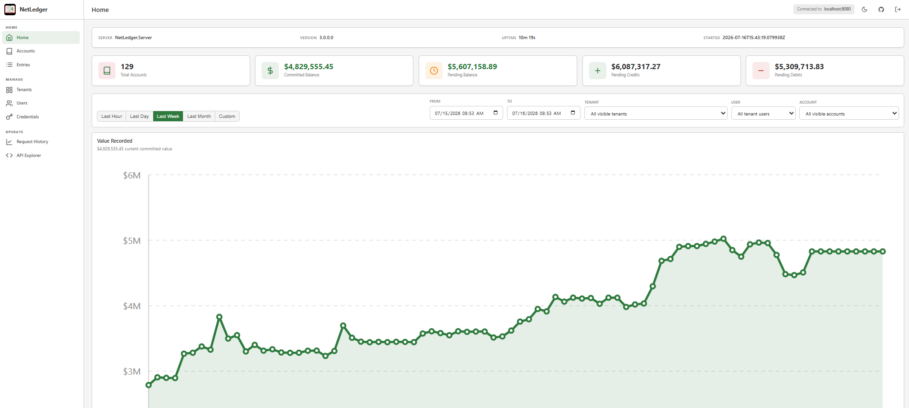
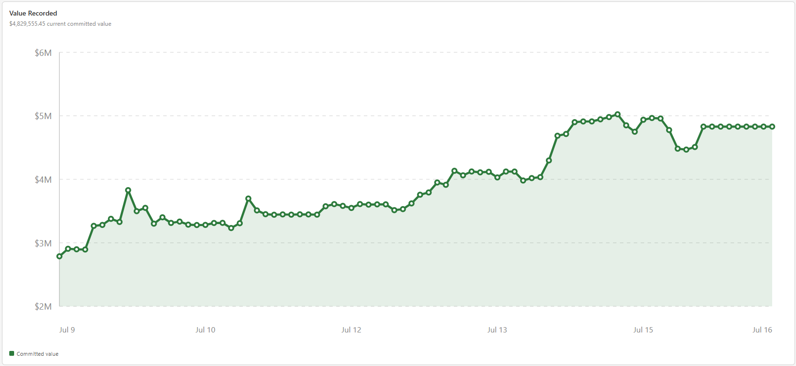
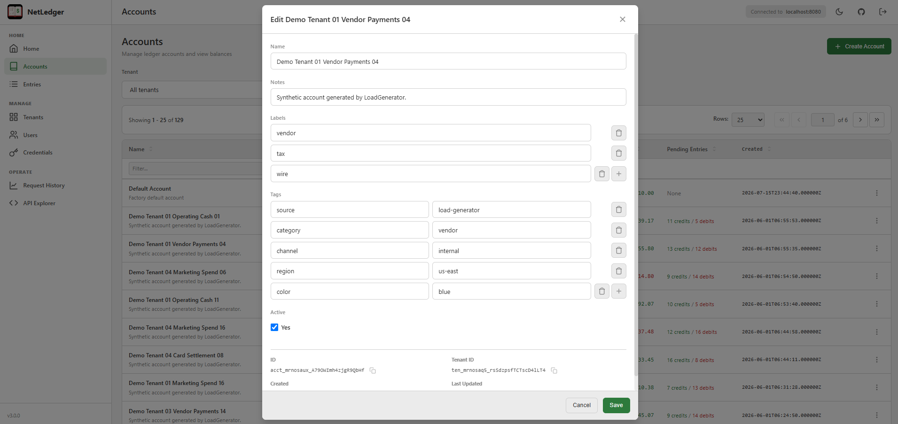
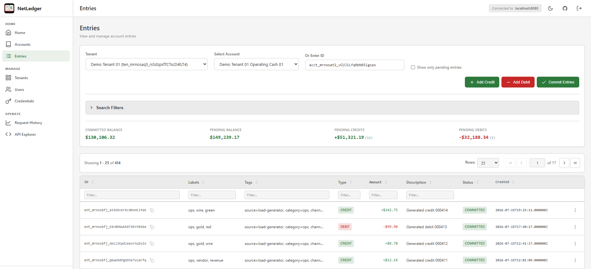
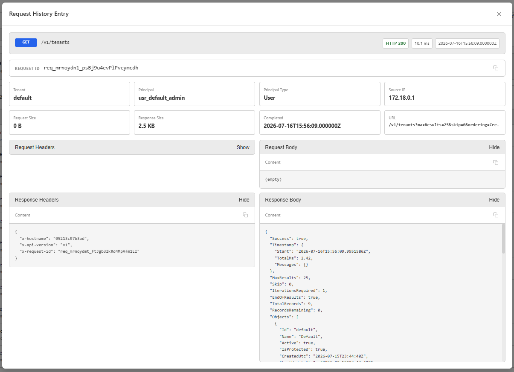

# NetLedger

[](https://www.nuget.org/packages/NetLedger/)
[](https://www.nuget.org/packages/NetLedger)
[](https://github.com/jchristn/NetLedger/blob/main/LICENSE.md)

NetLedger is a thread-safe ledgering library for .NET 8.0 and .NET 10.0 that provides tenant-aware debit/credit workflows with auditable pending and committed entry lifecycles.

It supports SQLite for embedded deployments and MySQL, PostgreSQL, and SQL Server for external database deployments.

Current release: v4.0.0.

<details>
<summary>Screenshots</summary>











</details>

## v4.0.0

NetLedger v4.0.0 is the archive-readiness release. It introduces active server archive configuration, typed CORS configuration, NetLedger Archive Server,
Docker Hub documentation, dashboard archive screens, SDK archive clients, and active-to-archive export APIs.

For user-facing archive setup and operating guidance, see [ARCHIVAL.md](ARCHIVAL.md).

What is new in v4.0.0:

- Active archive configuration in NetLedger Server through `Archive.Enabled`, `ArchiveServerEndpoint`, service credentials, `DefaultActiveDataRetentionDays`, automatic archival policy, and per-tenant retention overrides.
- Archive settings are configured at the server level, tenant retention level, and account automatic-archival level. The minimum effective retention window is one day.
- Supported deployment modes include active server only, active plus Archive Server with filesystem storage, active plus Archive Server with S3-compatible storage, and separate or shared physical databases when archive table names do not overlap.
- Retention settings clamp to 1 through `Int32.MaxValue` days and default to 365 days.
- NetLedger Server enforces the configured active-data boundary for entries, request history, and historical balance reads, returning typed `409` conflicts instead of silently blending active and cold rows.
- NetLedger Server service info exposes archive status, the Archive Server endpoint when enabled, the resolved retention window, and the active-data boundary.
- Typed `Webserver.Cors` settings for NetLedger Server and NetLedger Archive Server.
- `NetLedger.Archive` and `NetLedger.Archive.Server` projects with archive models, SQL catalog support, filesystem and S3-compatible storage pools, and NetLedger Server introspection auth.
- Archive Server routes cover health/OpenAPI, metadata, migration lifecycle, complete-coverage checks, archive verification, and JSONL.Gzip cold reads.
- NetLedger Server export APIs and a background automatic archival worker for pushing committed active entries to Archive Server migration batches.
- Account-specific automatic archival settings override global defaults and persist worker state, including retry metadata and archived-through watermarks.
- `DeleteAfterCommit=true` performs active cleanup only after Archive Server commit, preserving the entry balance chain and deleting exported request-history scope after commit.
- NetLedger dashboard Archive page for direct Archive Server endpoint configuration, cold entry and request-history queries, archive manifests, ranges, storage pools, and permission-aware metadata actions.
- Active/Archive selectors on Entries and Request History keep cold reads explicit.
- C#, JavaScript/TypeScript, and Python SDK archive method groups for active export calls and separately configured Archive Server cold reads.
- `ArchivalValidation` standalone smoke-test app for disposable active/archive servers, active export, Archive Server metadata, cold search/retrieval, hot/cold boundary failures, and SDK migration lifecycle validation.
- v4 Docker documentation and immutable image tag guidance.

## v3.0.0

NetLedger v3.0.0 is the tenant-aware release. Public objects now use PrettyId string IDs such as `acct_...`, `ent_...`, `ten_...`, `usr_...`, and `cred_...`; accounts and entries carry `TenantId`; and account/entry metadata can be set with `Labels` and `Tags`.

What is new in v3.0.0:

- Multi-tenancy: tenant, user, credential, session, role, permission, account-user mapping, and audit-record domain models.
- Tenant-scoped ledger data: accounts, entries, balances, commits, pending entries, credentials, users, sessions, audit records, roles, and permissions can be scoped by tenant.
- Tenant-aware APIs: `/v1/tenants/{tenantId}/...` route aliases and `x-tenant-id` support preserve existing `/v1` paths while making tenant scope explicit.
- PrettyId identifiers: public models now use K-sortable string IDs with prefixes such as `acct_`, `ent_`, `ten_`, `usr_`, and `cred_`.
- Metadata on accounts and entries: `List<string> Labels` and `Dictionary<string,string> Tags` are available in library models, REST payloads, SDKs, Postman, and dashboard forms.
- Metadata search and enumeration: account and entry searches can filter by labels and tags; entry enumeration also supports debit/credit amount bounds and amount/date ordering.
- Authentication and authorization: tenant discovery, email/password login, revocable server-side sessions, credential rotation/revocation, RBAC role assignment, and effective-permission checks.
- Dashboard v3 workflows: tenant-aware login, tenant/user/account filtering, account and entry metadata editors, label badges, formatted tag display, reveal controls for hidden secrets, and automatic return to login when authentication fails.
- Dashboard charts: Home now shows Value Recorded, Transactions over Time, and Amounts over Time with shared tenant/user/account/range controls, fixed time-bucket fidelity, and bounded hover tooltips; Request History includes a taller Traffic over Time chart with matching hover behavior.
- API tooling: OpenAPI is served at `GET /openapi.json`, the dashboard API Explorer executes requests with the signed-in session, `REST_API.md` and Postman cover tenant and metadata filters, and the .NET, JavaScript/TypeScript, and Python SDKs expose v3 search/enumeration options.
- Touchstone-backed tests: shared suites run through `Test.Shared`, `Test.Automated`, `Test.Xunit`, and `Test.Nunit` for provider certification and behavior coverage.

Authentication flow:

1. Call `POST /v1/auth/tenants` with `{ "Email": "user@example.com" }`.
2. If multiple tenants are returned, select the tenant to enter.
3. Call `POST /v1/auth/login` with tenant ID, email, and password.
4. Send the returned `Session.Token` as `Authorization: Bearer <token>` and send `x-tenant-id` for tenant-scoped requests.

Credential management is available through `/v1/credentials` and tenant-scoped credential routes. The legacy `/v1/apikeys` management paths are removed in v3.

Minimal v3 library example:

```csharp
using NetLedger;

await using Ledger ledger = new Ledger("accounting.db");

string accountId = await ledger.CreateAccountAsync("Operating Account", 1000.00m);

await ledger.AddCreditAsync(accountId, 500.00m, "Customer payment");

Balance balance = await ledger.CommitEntriesAsync(accountId);
```

## Who Should Use NetLedger

NetLedger is designed for developers building applications that require:

- **Tenant-Aware Ledger Workflows** - Scope accounts, entries, balances, users, credentials, sessions, roles, permissions, and audit records by tenant.
- **Controlled Financial Entry Lifecycles** - Keep pending entries separate from committed entries, then explicitly commit reviewed debits and credits.
- **Auditable Account Balances** - Maintain balance-entry chains that support point-in-time balance reads and integrity verification.
- **Role-Aware API Access** - Build systems with system admins, tenant admins, and account-scoped users using sessions, credentials, RBAC assignments, and effective-permission checks.
- **Metadata-Driven Search** - Attach labels and tags to accounts and entries, then filter and enumerate by metadata, amount bounds, timestamps, and ordering.
- **Database Choice** - Use SQLite for embedded/local deployments or MySQL, PostgreSQL, and SQL Server for external database deployments.
- **Concurrent Account Writes** - Serialize writes to the same account while allowing independent accounts to proceed in parallel.
- **API, Dashboard, and SDK Integration** - Use the core .NET library directly or integrate through the REST server, dashboard, Postman collection, and .NET, JavaScript/TypeScript, and Python SDKs.
- **Async .NET Applications** - Use async APIs with cancellation-token support throughout the library and server.

**Ideal use cases:** Financial applications, expense tracking systems, point-of-sale systems, accounting software, multi-user financial platforms, billing systems, payment processing, and applications requiring account-level debit/credit ledgers with strong auditability.

## What NetLedger Does

### Core Capabilities

- **Tenant Management** - Create and enumerate tenants, users, sessions, credentials, account-user mappings, roles, permissions, and audit records.
- **Authentication and Authorization** - Tenant discovery, email/password login, revocable sessions, credential management, admin flags, RBAC assignments, effective-permission checks, and scoped API access.
- **Account Management** - Create, retrieve, search, enumerate, update, and delete tenant-scoped accounts with optional initial balances.
- **Account and Entry Metadata** - Attach normalized labels and key/value tags to accounts and entries.
- **Transaction Operations** - Add credits and debits as pending entries or immediately committed entries.
- **Batch Operations** - Process multiple credits or debits in a single account-scoped batch.
- **Dual Balance Tracking** - Separate committed balance from pending/projected balance.
- **Selective Commits** - Commit all pending entries or a specific set of entries.
- **Entry Cancellation** - Cancel pending entries before they are committed.
- **Powerful Enumeration** - Filter accounts and entries by tenant, account, text, timestamps, amount bounds, debit/credit-specific bounds, labels, tags, and ordering.
- **Pagination Support** - Use skip/limit and continuation-token enumeration patterns for large result sets.
- **Point-in-Time Balances** - Calculate balances as of a historical timestamp.
- **Balance Chain Verification** - Validate audit-trail integrity across balance entries.
- **REST API, Dashboard, and SDKs** - Use NetLedger through the .NET library, REST server, dashboard, Postman collection, and .NET, JavaScript/TypeScript, and Python SDKs.
- **Request History and Charts** - Capture request history and summarize dashboard chart data over fixed time buckets.
- **Supported Databases** - SQLite, MySQL, PostgreSQL, and SQL Server providers are included.
- **Concurrent Write Safety** - Entries for the same account are serialized with in-process and database-backed account locks, while different accounts can proceed independently.

### What NetLedger Does NOT Do

- **Double-Entry Accounting** - NetLedger is an account-level debit/credit ledger. It does not enforce balanced journal entries across two or more accounts.
- **Multi-Currency Accounting** - Amounts are numeric ledger values; currency codes, FX rates, and currency conversion are application responsibilities.
- **Automatic Transfers** - There is no built-in transfer primitive that atomically debits one account and credits another account as a balanced pair.
- **Transaction Reversal Workflow** - Committed entries are not undone in place; create offsetting entries when a business reversal is required.
- **Scheduled or Recurring Transactions** - NetLedger does not schedule future-dated or recurring entries.
- **Account Hierarchies** - Accounts do not have built-in parent/child rollup relationships.
- **Budget Enforcement** - Spending limits, approvals, and budget controls are application-level concerns.
- **Arbitrary Custom Columns** - Accounts and entries have a defined schema. Use labels and tags for supported metadata filtering rather than adding arbitrary fields.
- **Cross-Database Transactions** - NetLedger does not coordinate a transaction across multiple independent database instances.

## Quick Start

Choose the approach that best fits your needs:

### Option 1: NuGet Package (Library Integration)

Install the library directly into your .NET application:

```bash
dotnet add package NetLedger
```

Or via NuGet Package Manager:

```powershell
Install-Package NetLedger
```

Then use it in your code:

```csharp
using NetLedger;

// Initialize ledger (creates or opens SQLite database)
Ledger ledger = new Ledger("accounting.db");

// Create an account with optional initial balance
string accountId = await ledger.CreateAccountAsync("Operating Account", 1000.00m);

// Add a pending credit
string creditId = await ledger.AddCreditAsync(accountId, 500.00m, "Customer payment");

// Add a pending debit
string debitId = await ledger.AddDebitAsync(accountId, 150.00m, "Supplier invoice");

// Check balances before commit
Balance balance = await ledger.GetBalanceAsync(accountId);
Console.WriteLine($"Committed: ${balance.CommittedBalance}");  // 1000.00
Console.WriteLine($"Pending: ${balance.PendingBalance}");      // 1350.00

// Commit all pending entries
balance = await ledger.CommitEntriesAsync(accountId);
Console.WriteLine($"Committed: ${balance.CommittedBalance}");  // 1350.00

// Cleanup
await ledger.DisposeAsync();
```

### Option 2: Build and Run from Source

Clone the repository and build locally:

```bash
# Clone the repository
git clone https://github.com/jchristn/NetLedger.git
cd NetLedger

# Build the solution
dotnet build src/NetLedger.sln

# Run the interactive test application
dotnet run --project src/Test/Test.csproj

# Run the automated test suite against SQLite
dotnet run --project src/Test.Automated/Test.Automated.csproj -- --dbtype sqlite

# Run the REST API server
dotnet run --project src/NetLedger.Server/NetLedger.Server.csproj
```

### Option 3: Docker

Run NetLedger Server and Dashboard using Docker Compose:

```bash
# Navigate to the docker directory
cd docker

# Start the server and dashboard
docker compose up -d

# View logs
docker compose logs -f
```

This starts:
- **NetLedger Server** on `http://localhost:8080` - REST API server
- **NetLedger Archive Server** on `http://localhost:8081` - cold-data API server
- **NetLedger Dashboard** on `http://localhost:3000` - Web-based management UI
- **Less3** on `http://localhost:8000` - preferred S3-compatible archive object store
- **Less3 UI** on `http://localhost:3001` - Less3 object-store dashboard

Fresh deployments create tenant `default` with `admin@netledger` / `password`.

The default Docker deployment is pre-wired for S3-compatible archival through Less3. Archive Server uses endpoint `http://less3:8000`, Less3's seeded `default` bucket and `default` credentials, and the `netledger-archive` object prefix.

Less3 persists its SQLite catalog, object files, temporary uploads, and logs under `docker/less3/`.

The single `compose.yaml` starts Less3, Less3 UI, NetLedger Server, NetLedger Archive Server, and NetLedger Dashboard together.

Production deployments should replace the sample `default/default` object-store credential with secret-manager injection, TLS, and a least-privilege bucket or prefix policy.

```bash
cd docker
docker compose up -d
```

To stop the services:

```bash
docker compose down
```

#### Docker Configuration

The Docker setup uses configuration files in the `docker/server/` directory:

**netledger.json** - Server configuration:
```json
{
  "Webserver": {
    "Hostname": "+",
    "Port": 8080,
    "Ssl": false,
    "Cors": {
      "Enabled": true,
      "AllowedOrigins": [ "http://localhost:3000" ],
      "AllowedMethods": [ "OPTIONS", "HEAD", "GET", "PUT", "POST", "DELETE" ],
      "AllowedHeaders": [ "*" ],
      "ExposedHeaders": [ "Content-Type", "x-netledger-data-scope", "x-request-id", "x-hostname", "x-api-version" ],
      "AllowCredentials": false,
      "MaxAgeSeconds": 600
    }
  },
  "Logging": {
    "EnableConsole": true,
    "LogRequests": true
  },
  "Authentication": {
    "Enabled": true,
    "DefaultAdminKey": "netledgeradmin"
  },
  "Database": {
    "Type": "Postgresql",
    "Hostname": "postgres",
    "Port": 5432,
    "Username": "netledger",
    "Password": "netledger",
    "DatabaseName": "netledger",
    "Schema": "public",
    "RequireEncryption": false,
    "ConnectionTimeoutSeconds": 30,
    "MaxPoolSize": 100,
    "LogQueries": false
  },
  "Archive": {
    "Enabled": false,
    "ArchiveServerEndpoint": "http://archive-server:8081",
    "ServiceAccessKey": "default",
    "ServiceSecretKey": "default",
    "DefaultActiveDataRetentionDays": 365,
    "Tenants": [],
    "Automatic": {
      "Enabled": false,
      "MaxRetentionDays": 365,
      "IntervalSeconds": 3600,
      "InitialDelaySeconds": 30,
      "MaxAccountsPerRun": 100,
      "MaxBatchRows": 50000,
      "DeleteAfterCommit": false,
      "StoragePoolId": "asp_default",
      "Retry": {
        "MaxAttempts": 3,
        "InitialDelaySeconds": 5,
        "MaxDelaySeconds": 300
      }
    }
  }
}
```

Environment overrides are supported for deployment-owned values. NetLedger Server accepts `NETLEDGER_DATABASE_*` plus these archive overrides:

```text
NETLEDGER_ARCHIVE_ENABLED
NETLEDGER_ARCHIVE_SERVER_ENDPOINT
NETLEDGER_ARCHIVE_SERVICE_ACCESS_KEY
NETLEDGER_ARCHIVE_SERVICE_SECRET_KEY
NETLEDGER_ARCHIVE_DEFAULT_ACTIVE_DATA_RETENTION_DAYS
NETLEDGER_ARCHIVE_AUTO_*
```

NetLedger Archive Server accepts the same database suffixes under `NETLEDGER_ARCHIVE_CATALOG_`.

Storage-pool overrides use `NETLEDGER_ARCHIVE_STORAGE_` for the default pool or `NETLEDGER_ARCHIVE_STORAGE_{POOL_ID}_` for a specific pool after uppercasing the pool ID and replacing non-alphanumeric characters with `_`.

For example, `asp_default` becomes `NETLEDGER_ARCHIVE_STORAGE_ASP_DEFAULT_BASE_PATH`. Supported storage suffixes are:

```text
TYPE
BASE_PATH
BUCKET
PREFIX
REGION
ENDPOINT
ACCESS_KEY
SECRET_KEY
SESSION_TOKEN
SERVER_SIDE_ENCRYPTION
FORMAT
COMPRESSION
```

Secret values are runtime-only and are not written to the archive catalog or returned by metadata APIs.

## Dashboard

NetLedger includes a web-based dashboard for managing accounts and viewing transactions.

### Starting the Dashboard

**With Docker (recommended):**
```bash
cd docker
docker compose up -d
```

**For development:**
```bash
cd src/NetLedger.Dashboard
npm install
npm run dev
```

### Accessing the Dashboard

- **Docker**: Open `http://localhost:3000` in your browser
- **Development**: Open `http://localhost:5173` in your browser (Vite default port)

The dashboard provides:
- Tenant, user, credential, account, and entry management based on the signed-in user's role
- Transaction entry (credits and debits)
- Label and tag metadata entry for accounts and entries
- Balance viewing and history
- Home charts for Value Recorded, Transactions over Time, and Amounts over Time with shared range, tenant, user, and account controls
- Chart hover tooltips with timestamp/value detail and fixed time-bucket fidelity for last hour, day, week, and month views
- Entry search and enumeration by tenant, account, description, date range, amount bounds, labels, tags, and ordering
- Entry commit operations
- API Explorer backed by `GET /openapi.json`
- Request History with filters, summaries, detail views, scoped deletion for admins, and a Traffic over Time chart
- Archive page for direct Archive Server endpoint configuration, cold entry reads, manifests, ranges, storage pools, migrations, archive verification, and permission-aware metadata actions
- Active/Archive data-source selectors on Entries and Request History for direct cold-data reads without blending active and archived rows

## SDKs

NetLedger provides official SDKs for integrating with the active REST API server and the NetLedger Archive Server:

### .NET SDK

```bash
dotnet add package NetLedger.Sdk
```

```csharp
using NetLedger.Sdk;

// Create a client with a session token or credential access key.
using NetLedgerClient client = new NetLedgerClient("http://localhost:8080", "netledgeradmin", "default");

// Create an account
Account account = await client.Account.CreateAsync("My Account");

// Add credits and debits
await client.Entry.AddCreditAsync(account.Id, 100.00m, "Deposit");
await client.Entry.AddDebitAsync(account.Id, 25.50m, "Purchase");

// Get balance and commit
Balance balance = await client.Balance.GetAsync(account.Id);
await client.Balance.CommitAsync(account.Id);

// API Explorer and Request History support
string openApiJson = await client.Service.GetOpenApiJsonAsync();
EnumerationResult<RequestHistoryEntry> history = await client.RequestHistory.EnumerateAsync(new RequestHistoryQuery { MaxResults = 25 });
```

Archive operations use separate active and archive clients so hot and cold data are never silently blended:

```csharp
using NetLedgerClient active = new NetLedgerClient("http://localhost:8080", "netledgeradmin", "default");
using NetLedgerClient archive = new NetLedgerClient("http://localhost:8081", "netledgeradmin", "default");

ArchiveExportResponse export = await active.Archive.ExportTenantAccountEntriesAsync(
    "default",
    account.Id,
    new ArchiveExportRequest { ToUtc = DateTime.UtcNow.AddDays(-365), DeleteAfterCommit = false });

EnumerationResult<Entry> coldEntries = await archive.Archive.TenantEntriesAsync(
    "default",
    account.Id,
    new ArchiveQuery { MaxResults = 25, AllowPartial = true });
```

See [sdk/sdk-csharp/NetLedger.Sdk/README.md](sdk/sdk-csharp/NetLedger.Sdk/README.md) for full documentation.

### JavaScript/TypeScript SDK

```bash
npm install netledger-sdk
```

```typescript
import { NetLedgerClient } from 'netledger-sdk';

// Create a client with a session token or credential access key.
const client = new NetLedgerClient('http://localhost:8080', 'netledgeradmin', { tenantId: 'default' });

// Create an account
const account = await client.account.create('My Account');

// Add credits and debits
await client.entry.addCredit(account.Id, 100.00, 'Deposit');
await client.entry.addDebit(account.Id, 25.50, 'Purchase');

// Get balance and commit
const balance = await client.balance.get(account.Id);
await client.balance.commit(account.Id);

// API Explorer and Request History support
const openApiSpec = await client.service.getOpenApiSpec();
const history = await client.requestHistory.enumerate({ MaxResults: 25 });
```

Archive operations use separate active and archive clients:

```typescript
const active = new NetLedgerClient('http://localhost:8080', 'netledgeradmin', { tenantId: 'default' });
const archive = new NetLedgerClient('http://localhost:8081', 'netledgeradmin', { tenantId: 'default' });

const exportResult = await active.archive.exportTenantAccountEntries('default', account.Id, {
    ToUtc: new Date(Date.now() - 365 * 24 * 60 * 60 * 1000).toISOString(),
    DeleteAfterCommit: false
});

const coldEntries = await archive.archive.tenantEntries('default', account.Id, {
    maxResults: 25,
    allowPartial: true
});
```

See [sdk/sdk-js/README.md](sdk/sdk-js/README.md) for full documentation.

### Python SDK

```bash
pip install netledger-sdk
```

```python
from datetime import datetime, timedelta, timezone
from netledger_sdk import NetLedgerClient

active = NetLedgerClient('http://localhost:8080', 'netledgeradmin', tenant_id='default')
archive = NetLedgerClient('http://localhost:8081', 'netledgeradmin', tenant_id='default')
account_id = 'acct_01h000000000000000000000'

export_result = active.archive.export_tenant_account_entries('default', account_id, {
    'ToUtc': (datetime.now(timezone.utc) - timedelta(days=365)).isoformat(),
    'DeleteAfterCommit': False
})

cold_entries = archive.archive.tenant_entries('default', account_id, {
    'maxResults': 25,
    'allowPartial': True
})
```

See [sdk/sdk-python/README.md](sdk/sdk-python/README.md) for full documentation.

## REST API

When running NetLedger Server (via Docker or directly), a full REST API is available for programmatic access.

**Base URL**: `http://localhost:8080`

**Authentication**: User sessions and credentials are accepted as bearer tokens via `Authorization: Bearer <token-or-access-key>`. Credential authentication can also use `x-access-key` and `x-secret-key`. Tenant scope can be supplied with `x-tenant-id` or tenant-scoped routes.

### Quick Examples

```bash
# Health check
curl http://localhost:8080/

# Create an account with label/tag metadata
curl -X PUT http://localhost:8080/v1/accounts \
  -H "Authorization: Bearer netledgeradmin" \
  -H "x-tenant-id: default" \
  -H "Content-Type: application/json" \
  -d '{"Name":"My Account","InitialBalance":100.00,"Labels":["operating","blue"],"Tags":{"department":"finance","color":"blue"}}'

# Add a credit with label/tag metadata
curl -X PUT http://localhost:8080/v1/accounts/{accountId}/credits \
  -H "Authorization: Bearer netledgeradmin" \
  -H "x-tenant-id: default" \
  -H "Content-Type: application/json" \
  -d '{"Amount":50.00,"Notes":"Customer payment","Labels":["blue"],"Tags":{"color":"blue"}}'

# Search entries by amount bounds, label, tag, and ordering
curl "http://localhost:8080/v1/accounts/{accountId}/entries?debitMin=5&debitMax=50&labels=blue&tags=color=blue&ordering=AmountDescending" \
  -H "Authorization: Bearer netledgeradmin" \
  -H "x-tenant-id: default"

# Get balance
curl http://localhost:8080/v1/accounts/{accountId}/balance \
  -H "Authorization: Bearer netledgeradmin" \
  -H "x-tenant-id: default"

# Commit pending entries
curl -X POST http://localhost:8080/v1/accounts/{accountId}/commit \
  -H "Authorization: Bearer netledgeradmin" \
  -H "x-tenant-id: default" \
  -H "Content-Type: application/json" \
  -d '{}'
```

For complete API documentation, see [REST_API.md](REST_API.md).

## Detailed Usage

### Account Management

```csharp
// Create account with zero balance
string accountId1 = await ledger.CreateAccountAsync("Checking Account");

// Create account with initial balance
string accountId2 = await ledger.CreateAccountAsync("Savings Account", 5000.00m);

// Create account with label/tag metadata
string operatingAccountId = await ledger.CreateAccountAsync(
    "Operating Account",
    1000.00m,
    labels: new List<string> { "operating", "blue" },
    tags: new Dictionary<string, string> { { "department", "finance" }, { "color", "blue" } }
);

// Create account with negative balance (e.g., credit card)
string accountId3 = await ledger.CreateAccountAsync("Credit Card", -250.00m);

// Retrieve account by name
Account accountByName = await ledger.GetAccountByNameAsync("Checking Account");

// Retrieve account by Id
Account accountById = await ledger.GetAccountByIdAsync(accountId1);

// Get all accounts
List<Account> accounts = await ledger.GetAllAccountsAsync();

// Search accounts with pagination
List<Account> results = await ledger.GetAllAccountsAsync(
    searchTerm: "Savings",
    skip: 0,
    take: 10
);

// Enumerate accounts by metadata. Labels and tags are all-must-match filters.
EnumerationResult<Account> blueFinanceAccounts = await ledger.EnumerateAccountsAsync(new EnumerationQuery
{
    MaxResults = 25,
    Labels = new List<string> { "blue" },
    Tags = new Dictionary<string, string> { { "department", "finance" } }
});

// Delete account by name
await ledger.DeleteAccountByNameAsync("Checking Account");

// Delete account by Id
await ledger.DeleteAccountByIdAsync(accountId1);
```

### Adding Transactions

```csharp
string accountId = await ledger.CreateAccountAsync("Revenue Account", 0m);

// Add pending credit (default)
string entryId = await ledger.AddCreditAsync(
    accountId,
    amount: 250.00m,
    notes: "Invoice #1234"
);

// Add pending credit with label/tag metadata
string labeledCreditId = await ledger.AddCreditAsync(
    accountId,
    amount: 175.00m,
    notes: "Blue customer payment",
    labels: new List<string> { "blue", "customer-payment" },
    tags: new Dictionary<string, string> { { "color", "blue" }, { "source", "dashboard" } }
);

// Add immediately committed credit
string committedId = await ledger.AddCreditAsync(
    accountId,
    amount: 100.00m,
    notes: "Cash sale",
    isCommitted: true
);

// Add pending debit
string debitId = await ledger.AddDebitAsync(
    accountId,
    amount: 50.00m,
    notes: "Bank fee"
);

// Batch add multiple credits
List<BatchEntryInput> credits = new List<BatchEntryInput>
{
    new BatchEntryInput(100.00m, "Sale 1"),
    new BatchEntryInput(200.00m, "Sale 2"),
    new BatchEntryInput(150.00m, "Sale 3")
};
List<string> creditIds = await ledger.AddCreditsAsync(accountId, credits);

// Batch add multiple debits
List<BatchEntryInput> debits = new List<BatchEntryInput>
{
    new BatchEntryInput(25.00m, "Fee 1"),
    new BatchEntryInput(30.00m, "Fee 2")
};
List<string> debitIds = await ledger.AddDebitsAsync(accountId, debits);

// Batch add with immediate commit
List<string> committedIds = await ledger.AddCreditsAsync(
    accountId,
    credits,
    isCommitted: true
);
```

### Working with Balances

```csharp
string accountId = await ledger.CreateAccountAsync("Main Account", 1000.00m);

// Add some pending transactions
await ledger.AddCreditAsync(accountId, 500.00m, "Pending credit");
await ledger.AddDebitAsync(accountId, 100.00m, "Pending debit");

// Get current balance
Balance balance = await ledger.GetBalanceAsync(accountId);

Console.WriteLine($"Account: {balance.Name}");
Console.WriteLine($"Committed Balance: ${balance.CommittedBalance}");  // 1000.00
Console.WriteLine($"Pending Balance: ${balance.PendingBalance}");      // 1400.00

// Examine pending transactions
Console.WriteLine($"Pending Credits: {balance.PendingCredits.Count} totaling ${balance.PendingCredits.Total}");
Console.WriteLine($"Pending Debits: {balance.PendingDebits.Count} totaling ${balance.PendingDebits.Total}");

// Access individual pending entries
foreach (Entry entry in balance.PendingCredits.Entries)
{
    Console.WriteLine($"  Credit: ${entry.Amount} - {entry.Description}");
}

// Get balances for all accounts
Dictionary<string, Balance> allBalances = await ledger.GetAllBalancesAsync();
foreach (KeyValuePair<string, Balance> kvp in allBalances)
{
    Console.WriteLine($"{kvp.Value.Name}: ${kvp.Value.CommittedBalance}");
}

// Get balance as of specific date/time
DateTime asOf = new DateTime(2024, 12, 31, 23, 59, 59, DateTimeKind.Utc);
decimal historicalBalance = await ledger.GetBalanceAsOfAsync(accountId, asOf);
```

### Committing Transactions

```csharp
string accountId = await ledger.CreateAccountAsync("Operations", 500.00m);

// Add several pending entries
string credit1 = await ledger.AddCreditAsync(accountId, 100.00m, "Entry 1");
string credit2 = await ledger.AddCreditAsync(accountId, 200.00m, "Entry 2");
string debit1 = await ledger.AddDebitAsync(accountId, 50.00m, "Entry 3");

// Commit ALL pending entries
Balance balance = await ledger.CommitEntriesAsync(accountId);
Console.WriteLine($"New Balance: ${balance.CommittedBalance}");  // 750.00

// Add more pending entries
string credit3 = await ledger.AddCreditAsync(accountId, 300.00m, "Entry 4");
string credit4 = await ledger.AddCreditAsync(accountId, 400.00m, "Entry 5");
string debit2 = await ledger.AddDebitAsync(accountId, 75.00m, "Entry 6");

// Commit SPECIFIC entries only
List<string> toCommit = new List<string> { credit3, debit2 };
balance = await ledger.CommitEntriesAsync(accountId, toCommit);

Console.WriteLine($"Committed Balance: ${balance.CommittedBalance}");  // 975.00
Console.WriteLine($"Pending Balance: ${balance.PendingBalance}");      // 1375.00 (includes uncommitted credit4)

// Examine what was committed
Console.WriteLine($"Committed Entry identifiers: {string.Join(", ", balance.Committed)}");
```

### Managing Pending Entries

```csharp
string accountId = await ledger.CreateAccountAsync("Test Account", 100.00m);

await ledger.AddCreditAsync(accountId, 50.00m, "Credit 1");
await ledger.AddCreditAsync(accountId, 75.00m, "Credit 2");
await ledger.AddDebitAsync(accountId, 25.00m, "Debit 1");
await ledger.AddDebitAsync(accountId, 30.00m, "Debit 2");

// Get all pending entries
List<Entry> allPending = await ledger.GetPendingEntriesAsync(accountId);
Console.WriteLine($"Total pending: {allPending.Count}");  // 4

// Get only pending credits
List<Entry> pendingCredits = await ledger.GetPendingCreditsAsync(accountId);
Console.WriteLine($"Pending credits: {pendingCredits.Count}");  // 2

// Get only pending debits
List<Entry> pendingDebits = await ledger.GetPendingDebitsAsync(accountId);
Console.WriteLine($"Pending debits: {pendingDebits.Count}");  // 2

// Cancel a pending entry
string entryToCancel = allPending[0].Id;
await ledger.CancelPendingAsync(accountId, entryToCancel);

// Verify cancellation
List<Entry> afterCancel = await ledger.GetPendingEntriesAsync(accountId);
Console.WriteLine($"Remaining pending: {afterCancel.Count}");  // 3
```

### Querying Transaction History

```csharp
string accountId = await ledger.CreateAccountAsync("History Test", 0m);

// Add and commit various transactions
await ledger.AddCreditAsync(accountId, 100.00m, "January sale", isCommitted: true);
await Task.Delay(100);  // Ensure different timestamps
await ledger.AddDebitAsync(accountId, 50.00m, "February expense", isCommitted: true);
await Task.Delay(100);
await ledger.AddCreditAsync(accountId, 200.00m, "March sale", isCommitted: true);

// Get entries with basic filtering (excludes balance entries by default)
List<Entry> entries = await ledger.GetEntriesAsync(
    accountId,
    skip: 0,
    take: 10
);

// Paginated enumeration with filtering
EnumerationQuery query = new EnumerationQuery
{
    AccountId = accountId,
    MaxResults = 10,
    Ordering = EnumerationOrderEnum.AmountDescending,
    AmountMinimum = 75.00m,     // Only entries >= $75
    AmountMaximum = 250.00m,    // Only entries <= $250
    CreatedAfterUtc = new DateTime(2025, 1, 1, 0, 0, 0, DateTimeKind.Utc),
    CreatedBeforeUtc = DateTime.UtcNow
};

EnumerationResult<Entry> result = await ledger.EnumerateTransactionsAsync(query);

Console.WriteLine($"Found {result.TotalRecords} total records");
Console.WriteLine($"Returned {result.Objects.Count} records");
Console.WriteLine($"Records remaining: {result.RecordsRemaining}");

foreach (Entry entry in result.Objects)
{
    string type = entry.Type == EntryType.Credit ? "Credit" : "Debit";
    Console.WriteLine($"{entry.CreatedUtc:yyyy-MM-dd} {type}: ${entry.Amount} - {entry.Description}");
}

// Continue with next page if not at end
if (!result.EndOfResults && result.ContinuationToken != null)
{
    query.ContinuationToken = result.ContinuationToken;
    EnumerationResult<Entry> nextPage = await ledger.EnumerateTransactionsAsync(query);
}
```

Complex metadata and debit-specific searches use the same enumeration surface. Labels and tags are all-must-match filters:

```csharp
EnumerationQuery blueDebitQuery = new EnumerationQuery
{
    AccountId = accountId,
    MaxResults = 50,
    Ordering = EnumerationOrderEnum.AmountDescending,
    DebitMinimum = 5.00m,
    DebitMaximum = 50.00m,
    Labels = new List<string> { "blue" },
    Tags = new Dictionary<string, string> { { "color", "blue" } }
};

EnumerationResult<Entry> blueDebits = await ledger.EnumerateTransactionsAsync(blueDebitQuery);
```

### Audit Trail and Balance Verification

```csharp
string accountId = await ledger.CreateAccountAsync("Audit Test", 1000.00m);

// Perform several commit operations to create balance chain
await ledger.AddCreditAsync(accountId, 100.00m, isCommitted: true);
await ledger.AddDebitAsync(accountId, 50.00m, isCommitted: true);
await ledger.AddCreditAsync(accountId, 200.00m, isCommitted: true);

// Each commit creates a new balance entry that replaces the previous one.
// This creates an immutable chain of balance entries.

// Verify the integrity of the balance chain
bool isValid = await ledger.VerifyBalanceChainAsync(accountId);
if (isValid)
{
    Console.WriteLine("Balance chain is valid - audit trail intact");
}
else
{
    Console.WriteLine("WARNING: Balance chain is broken - possible data corruption");
}

// The public verifier walks the internal balance-entry chain and returns false
// if the chain is broken or cyclic.
```

### Event Handling

```csharp
Ledger ledger = new Ledger("events.db");

// Subscribe to events
ledger.AccountCreated += (sender, args) =>
{
    Console.WriteLine($"Account created: {args.Name} (Id: {args.Id})");
};

ledger.AccountDeleted += (sender, args) =>
{
    Console.WriteLine($"Account deleted: {args.Name}");
};

ledger.CreditAdded += (sender, args) =>
{
    Console.WriteLine($"Credit added to {args.Account.Name}: ${args.Entry.Amount}");
};

ledger.DebitAdded += (sender, args) =>
{
    Console.WriteLine($"Debit added to {args.Account.Name}: ${args.Entry.Amount}");
};

ledger.EntryCanceled += (sender, args) =>
{
    Console.WriteLine($"Entry canceled: {args.Entry.Id}");
};

ledger.EntriesCommitted += (sender, args) =>
{
    Console.WriteLine($"Entries committed to {args.Account.Name}");
    Console.WriteLine($"  Before: ${args.BalanceBefore.CommittedBalance}");
    Console.WriteLine($"  After: ${args.BalanceAfter.CommittedBalance}");
};

// Perform operations - events will fire asynchronously
string accountId = await ledger.CreateAccountAsync("Event Test", 100.00m);
await ledger.AddCreditAsync(accountId, 50.00m);
await ledger.CommitEntriesAsync(accountId);

await ledger.DisposeAsync();
```

### Cancellation Token Support

```csharp
// Create a cancellation token source with timeout
using CancellationTokenSource cts = new CancellationTokenSource(TimeSpan.FromSeconds(30));

try
{
    // All async methods support cancellation
    string accountId = await ledger.CreateAccountAsync("Cancelable Account", token: cts.Token);

    await ledger.AddCreditAsync(accountId, 100.00m, token: cts.Token);

    Balance balance = await ledger.GetBalanceAsync(accountId, token: cts.Token);

    await ledger.CommitEntriesAsync(accountId, token: cts.Token);
}
catch (OperationCanceledException)
{
    Console.WriteLine("Operation was canceled");
}
```

### Thread Safety Example

```csharp
string accountId = await ledger.CreateAccountAsync("Concurrent Account", 0m);

// Multiple threads can safely operate on the same account.
// NetLedger uses account-keyed in-process locks and database-backed account locks.
List<Task> tasks = new List<Task>();

for (int i = 0; i < 100; i++)
{
    int capture = i;
    tasks.Add(Task.Run(async () =>
    {
        await ledger.AddCreditAsync(accountId, 10.00m, $"Concurrent credit {capture}");
    }));
}

await Task.WhenAll(tasks);

Balance balance = await ledger.GetBalanceAsync(accountId);
Console.WriteLine($"Final pending balance: ${balance.PendingBalance}");  // 1000.00
```

## Architecture Notes

### Pending vs. Committed Model

NetLedger enforces a two-phase transaction model:

1. **Pending Phase** - Entries are created with `IsCommitted = false`
   - Can be canceled via `CancelPendingAsync()`
   - Visible in `PendingBalance` but not `CommittedBalance`
   - Retrievable via `GetPendingEntriesAsync()`, `GetPendingCreditsAsync()`, `GetPendingDebitsAsync()`

2. **Committed Phase** - Entries are finalized via `CommitEntriesAsync()`
   - Cannot be canceled or modified (immutable)
   - Included in `CommittedBalance`
   - Linked to a balance entry via `CommittedById`
   - Creates a new balance entry in the audit chain

This model enables "draft transactions" that can be reviewed, approved, and finalized separately from the committed ledger state.

### Balance Entry Chain

Each commit operation creates a special `EntryType.Balance` entry that:
- Summarizes the current committed balance
- Links to the previous balance entry via the `Replaces` field
- Creates an immutable audit trail from one balance entry to the next
- Can be verified for integrity via `VerifyBalanceChainAsync()`

This chain provides forensic accounting capabilities and prevents tampering with historical balances.

### Account-Level Locking

NetLedger uses account-keyed in-process locks plus database-backed account locks to provide per-account write serialization:
- Operations on different accounts execute in parallel
- Operations on the same account are serialized to prevent race conditions
- Locks are acquired asynchronously and released after the account mutation completes
- All locks are released in `finally` blocks to prevent deadlocks
- Supports cancellation tokens for responsive lock acquisition

### Database Schema

NetLedger supports SQLite, MySQL, PostgreSQL, and SQL Server. Provider DDL is kept in source under `src/NetLedger/Database/*/Queries/SetupQueries.cs`; account, entry, credential, and identity records use PrettyId string identifiers in `id` columns across supported providers.

The v3 schema includes these primary tables:

| Table | Purpose |
| --- | --- |
| `accounts` | Tenant-scoped ledger accounts with notes, labels, tags, active state, and timestamps. |
| `entries` | Account entries for debits, credits, and balance snapshots, including commit linkage and metadata. |
| `accountlocks` | Database-backed per-account lock ownership and expiration records. |
| `schemamigrations` | Applied schema migration records. |
| `tenants` | Tenant records, optional parent link, region, active/protected flags, and timestamps. |
| `users` | Tenant users with email, password hash, admin flags, active/protected flags, and timestamps. |
| `credentials` | User credentials with access key, secret verifier material, auth mode, active/protected flags, and timestamps. |
| `authsessions` | Revocable user sessions with token, expiration, and revocation timestamps. |
| `accountusermaps` | Tenant/account/user mappings used for account-scoped access. |
| `auditrecords` | Authorization and security audit events. |
| `requesthistory` | Captured API request/response metadata for request history and traffic charts. |
| `userroles`, `permissions`, `rolepermissionmaps`, `userroleassignments`, `credentialscopeassignments` | RBAC roles, permissions, mappings, and scoped assignments. |

Public account records map to:
- `Id`
- `TenantId`
- `Name`
- `Notes`
- `Labels`
- `Tags`
- `Active`
- `CreatedUtc`
- `LastUpdateUtc`

Public entry records map to:
- `Id`
- `TenantId`
- `AccountId`
- `Type` (`Debit`, `Credit`, or `Balance`)
- `Amount`
- `Description`
- `Replaces`
- `IsCommitted`
- `CommittedById`
- `CommittedUtc`
- `Labels`
- `Tags`
- `CreatedUtc`
- `LastUpdateUtc`

SQLite stores timestamps in UTC using six fractional digits. MySQL, PostgreSQL, and SQL Server use equivalent provider-specific column types and quoting.

## Performance Considerations

- **Connection Pooling**: External database providers use configurable pooling up to 500 connections; the default maximum is 100.
- **Batch Operations**: Use `AddCreditsAsync()` and `AddDebitsAsync()` for bulk inserts
- **Pagination**: Use `EnumerateTransactionsAsync()` with continuation tokens for large result sets (max 1000 records per query)
- **Account Locking**: Lock contention only occurs within the same account; different accounts have no lock interaction
- **Async Throughout**: All I/O operations are async to prevent thread pool starvation

## Example: Simple Inter-Account Transfer

```csharp
// NetLedger does not have built-in transfer operations
// Implement transfers by debiting one account and crediting another

async Task TransferAsync(Ledger ledger, string fromAccount, string toAccount, decimal amount, string notes)
{
    string description = $"Transfer: {notes}";

    // Debit the source account
    string debitId = await ledger.AddDebitAsync(fromAccount, amount, description);

    // Credit the destination account
    string creditId = await ledger.AddCreditAsync(toAccount, amount, description);

    // Commit both entries
    await ledger.CommitEntriesAsync(fromAccount, new List<string> { debitId });
    await ledger.CommitEntriesAsync(toAccount, new List<string> { creditId });
}

// Usage
string checking = await ledger.CreateAccountAsync("Checking", 1000.00m);
string savings = await ledger.CreateAccountAsync("Savings", 500.00m);

await TransferAsync(ledger, checking, savings, 200.00m, "Monthly savings");
```

## Requirements

- **.NET 8.0** or **.NET 10.0**
- **Database provider**: SQLite is bundled for embedded use; MySQL, PostgreSQL, and SQL Server require reachable database instances and credentials.

## Dependencies

- **AsyncKeyedLock** (v8.0.2) - Account-keyed in-process locking
- **Padlock** (v1.0.4) - Database-backed account lock coordination
- **Microsoft.Data.Sqlite** (v10.0.10) and **SQLitePCLRaw.bundle_e_sqlite3** (v3.0.4) - SQLite provider
- **MySqlConnector** (v2.6.1) - MySQL provider
- **Npgsql** (v10.0.3) - PostgreSQL provider
- **Microsoft.Data.SqlClient** (v7.0.2) - SQL Server provider
- **PrettyId** (v2.0.1) - K-sortable public string IDs
- **Timestamps** (v1.0.12) - Timestamp utilities

## License

MIT License - See [LICENSE.md](LICENSE.md) for details

## Contributing

Contributions are welcome! Please see [CONTRIBUTING.md](CONTRIBUTING.md) for guidelines.

## Support

- **Issues**: [GitHub Issues](https://github.com/jchristn/NetLedger/issues)
- **Discussions**: [GitHub Discussions](https://github.com/jchristn/NetLedger/discussions)
- **NuGet Package**: [NetLedger on NuGet](https://www.nuget.org/packages/NetLedger/)

## Version History

### v4.0.0 (Current)
- Active archive integration settings, retention policy configuration, typed CORS settings, Archive Server SQL catalog support, and filesystem and S3-compatible archive storage.
  Migration lifecycle routes, archive verification, and optional post-commit active cleanup.
  JSONL.Gzip cold entry and request-history reads, SDK archive clients, the `ArchivalValidation` live smoke-test app, dashboard archive-query requirements, and Docker Hub documentation.

### v3.0.0
- Tenant-scoped ledger data, authentication, authorization, credentials, sessions, RBAC, and audit records.
- PrettyId string identifiers on public models.
- Account and entry labels/tags with metadata-aware search and enumeration.
- SQLite, MySQL, PostgreSQL, and SQL Server providers.
- Dashboard charts, request history, API Explorer, Touchstone-backed tests, LoadGenerator, REST API docs, Postman, and SDK updates.

See [CHANGELOG.md](CHANGELOG.md) for complete version history.
